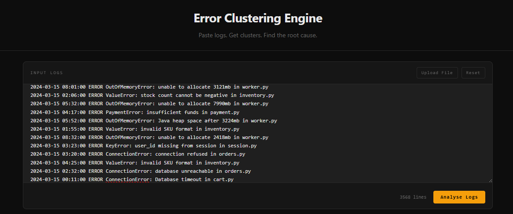
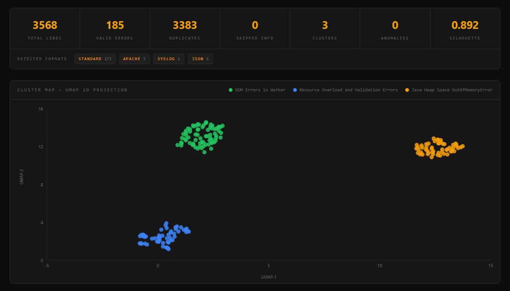
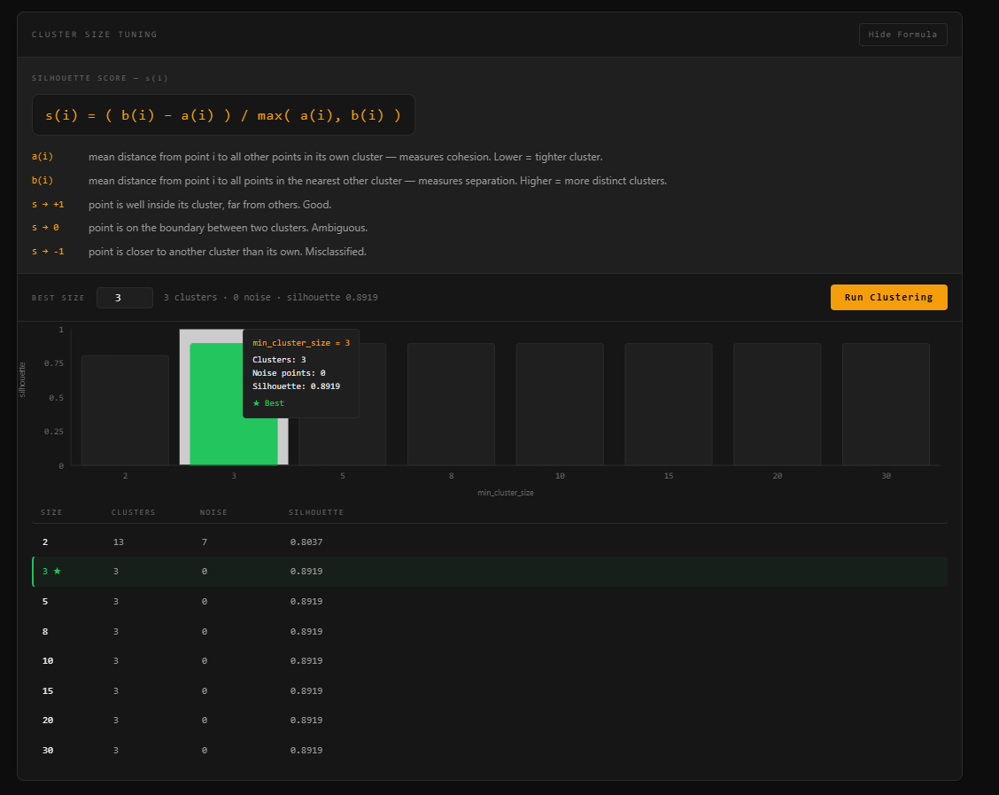
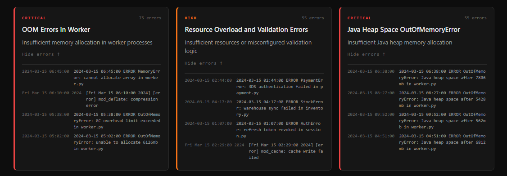
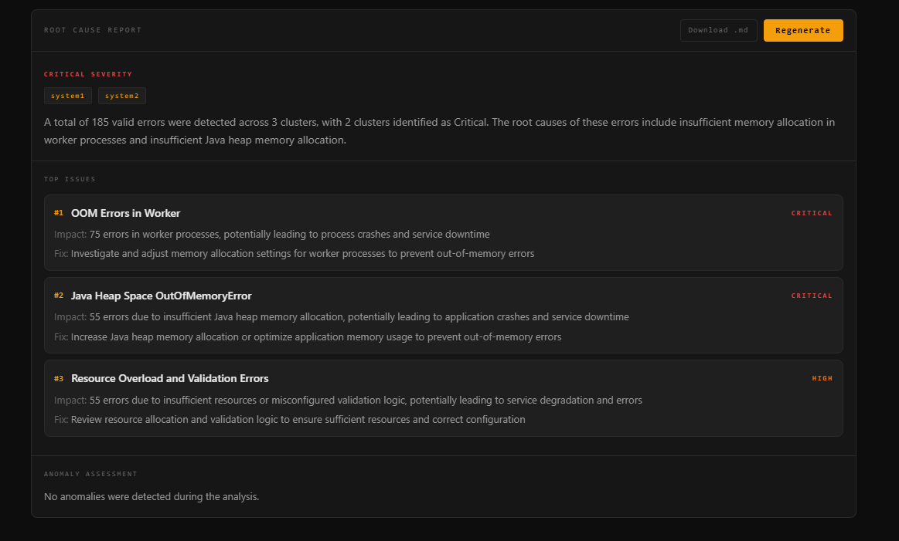
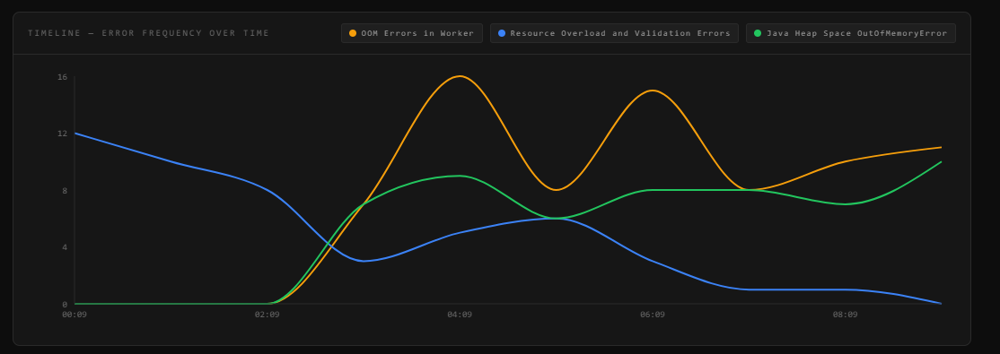

# Error Clustering Engine

Your logs have 3568 lines. You don't have time to read them.

This system reads them for you, groups the noise into clusters, names what went wrong, and tells you where to look first.

Paste logs. Get clusters. Find the root cause.


---

## Live demo

🔗 [Try it here](https://your-demo-link-here)

---

## Demo

> [](https://your-demo-link-here)
> *Click to watch the demo*

---

## What it does

You paste raw logs. Any format, any volume. The engine parses them, strips duplicates, embeds each error with a sentence transformer, clusters them using HDBSCAN, and hands the clusters to Llama 3.1 via Groq which names each one, assigns severity, and writes a root cause report.

Three clusters from 3568 lines. Silhouette score of 0.892. Zero noise points. Two critical, one high.

---

## How it works

```
raw logs
  parse + dedup
  embed (all-MiniLM-L6-v2)
  UMAP 2D reduction
  HDBSCAN cluster
  silhouette sweep across min_cluster_size values
  LLM label + severity per cluster (Llama 3.1 via Groq)
  root cause report
```

---

## What's inside

### Log parsing

The parser detects log formats automatically: Standard, Apache, Syslog, HDFS, Java, JSON, and Python tracebacks. It extracts the error type, module name, and timestamp from each line. INFO lines are filtered out. Duplicates are caught by MD5 hashing the cleaned message before anything else runs.

From the demo run: 3568 total lines, 185 valid errors, 3383 duplicates removed.

> 

---

### Embedding

Valid errors are embedded using `all-MiniLM-L6-v2` via sentence-transformers, batched at 64 lines at a time. The cleaned message is what gets embedded, not the raw log line. Timestamps, IPs, hex addresses, PIDs, and UUIDs are all stripped before embedding so the model focuses on the error semantics.

---

### UMAP reduction

Before clustering, embeddings are reduced to 2D using UMAP with `n_neighbors=15` and `min_dist=0.1`. The 2D coordinates are what HDBSCAN clusters on, and also what gets rendered in the cluster map.

---

### HDBSCAN clustering

HDBSCAN runs on the 2D UMAP coordinates using euclidean distance. Points that don't belong to any cluster get label `-1` and are tracked separately as anomalies. No need to specify the number of clusters upfront.

> 

---

### Cluster size tuning

The tune endpoint sweeps `min_cluster_size` across `[2, 3, 5, 8, 10, 15, 20, 30]` and scores each result with the silhouette score:

```
s(i) = ( b(i) - a(i) ) / max( a(i), b(i) )
```

`a(i)` is the mean distance from a point to everything else in its cluster. `b(i)` is the mean distance to all points in the nearest other cluster. The best size is the one with the highest silhouette and fewest noise points.

> 

---

### LLM labeling

Each cluster sends up to 5 representative log lines to Llama 3.1 8B Instant via Groq. The model returns a short label, a one sentence root cause hypothesis, and a severity level (Critical, High, Medium, or Low). Temperature is set to 0.2 to keep outputs consistent across runs.

If the model returns malformed JSON, the cluster falls back to `Cluster N` with severity Medium.

> 

---

### Root cause report

A second LLM call takes the full cluster summary and generates a structured incident report: executive summary, top 3 issues ranked by error count, impact per issue, a concrete suggested fix, anomaly assessment, and estimated affected systems. Downloadable as Markdown.

> 

---

### Timeline

Error frequency per cluster is bucketed over time. The bucket size adapts to the log window: 5 minutes for under an hour, 15 minutes for under 6 hours, 60 minutes for under a day. The chart shows when each cluster peaks and whether they overlap in time.

> 

---

## Pipeline

```
input
  format detection (Standard / Apache / Syslog / HDFS / Java / JSON / Python traceback)
  error filtering + MD5 dedup
  sentence-transformer embedding (all-MiniLM-L6-v2, batch size 64)
  UMAP 2D reduction (n_neighbors=15, min_dist=0.1, random_state=42)
  HDBSCAN clustering (euclidean, prediction_data=True)
  silhouette sweep (min_cluster_size 2 through 30)
  Llama 3.1 8B via Groq: label + severity + root cause per cluster
  Llama 3.1 8B via Groq: full incident report
  adaptive timeline bucketing by cluster
```

---

## Stack

- **Clustering** -- HDBSCAN
- **Dimensionality reduction** -- UMAP
- **Embeddings** -- sentence-transformers (`all-MiniLM-L6-v2`)
- **LLM** -- Llama 3.1 8B Instant via Groq API
- **Backend** -- FastAPI
- **Frontend** -- React

---

## Run it yourself

```
git clone https://github.com/your-username/error-clustering-engine
cd error-clustering-engine
pip install -r requirements.txt
```

Set up your Groq API key:

```
echo "GROQ_API_KEY=your_key_here" > .env
```

Build the frontend:

```
cd frontend
npm install
npm run build
```

Run:

```
uvicorn main:app --reload
```

Open `http://localhost:8000`, paste logs, click Analyse.

---

## Things I learned building this

- Deduplication before embedding is not optional. 3383 out of 3568 lines were duplicates in the demo run. Without MD5 dedup on the cleaned message, clusters collapse around frequency rather than error type.
- UMAP before HDBSCAN changes the results significantly. Running HDBSCAN on raw high-dimensional embeddings gives worse cluster separation than running it on the 2D projection. The silhouette score reflects this.
- `min_cluster_size` is the one parameter that actually matters. In the demo, sizes 3 through 30 all produced identical silhouette scores and the same 3 clusters. Size 2 gave 13 clusters and 7 noise points. The sweep makes this automatic instead of a guess.
- Temperature at 0.2 for LLM labeling is important. Higher and severity labels become inconsistent across runs. Lower and everything collapses to the same generic phrasing.
- The timeline bucket size needs to adapt to the log window. A fixed 5 minute bucket on a 24 hour log produces 288 data points. Adaptive bucketing keeps the chart readable regardless of how long the logs span.

---

## What's next

- Streaming log ingestion (tail style input)
- Cross-run comparison to track whether clusters grow or shrink over time
- Anomaly clustering as a separate pass instead of discarding noise points